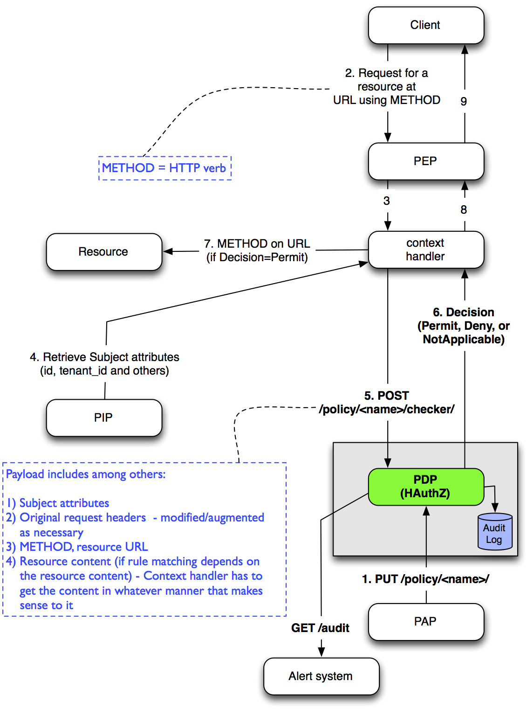

===============================================
Hypermedia API Authorization Framework (hauthz)
===============================================

.. raw:: html

  

.. role:: red

.. _XACML: http://docs.oasis-open.org/xacml/3.0/xacml-3.0-core-spec-os-en.pdf

.. _JsonPath: http://goessner.net/articles/JsonPath/

.. _Identity: http://docs.rackspace.com/auth/api/v2.0/auth-client-devguide/content/Overview-d1e65.html

.. _sub-users: http://docs.rackspace.com/auth/api/v2.0/auth-client-devguide/content/Sub-Users-d1e910.html

Intro
=====

What is this about? This API allows you to,

- Centrally store all authorization policies for providing role based, context based, and instance based access control for all of your hypermedia api services and other application components.

- Check if a given request can be satisfied for access by a service based on the stored policies.

Why do I care ?

- So that your services do not have have to worry about the AuthZ cross cutting concerns (just like XACML_). Also, see `Concepts`_.

What this is not about?

- This is not identity management system. 
- It is assumed that the caller of this API has securely identified the user who is making request to your Hypermedia API or other application component and obtained any subject attributes that are necessary making policy decisions.

Features
========

Following are the features of the authorization framework. Using this framework a component or Hypermedia API/Service in your enterprise can make access control decision based on:

- Subject/User roles and other attributes like email or id.
- Matching resource URL with a regular expression
- Matching resource URL template parameters with resource URL and using some contextual data (like header fields) for parameter values
- Matching on the HTTP method/verb used by your Hypermedia API's client
- Json path expression in the resource content matching to some contextual data (like subject username)
- Instance level access (for example, only username="x" can access resource "y")

See `Quickstart`_ and `Samples`_ for details.

Also, note that this is not Authentication system.

Quickstart
==========

1) Make sure you have a valid username/password with Rackspace Cloud `Identity`_. Replace the place holders <USERNAME> and <PASSWORD> in the below examples with your username and password. Both admin users and `sub-users`_ would work.

2) A poc server is running at 50.57.226.80:8080 that you can use with your username/password.

3) Create policy following the API specification. For e.g.,

::

   $ cat servers_policy.json 
   {
        "policy": {

            "ruleCombiningAlg" : "denyOverrides",
            "description"      : "A policy controlling access to cloud servers API",
            "rules" : [
                {
                    "effect"      : "Permit",
                    "description" : "Permit GET on /tenants/{tenantId}/servers/{serverId} if the http header 'X-Tenant-Id' matches URL value for parameer tenantId",
                    "rule" : "(Method in [GET]) & (Url % '/tenants/{tenantId}/servers/{serverId}') & (Url['tenantId'] == Headers['X-Tenant-Id'])"
                }
            ]
        }
    }

::

   $ curl -k -X PUT -H "X-Auth-User: <USERNAME>" -H "X-Auth-Password: <PASSWORD>" -H "Content-Type: application/json" https://50.57.226.80:8080/policy/servers_policy/ -d @servers_policy.json
   
   {"status": "ok"}
    

3) In your application or web service (or interceptor, service intermediary or servlet filter, or WSGI middleware) check if an incoming request can be authorized by a policy. For e.g.,

::

    $ cat servers_test1.json 
    {
        "method" : "GET",
        "url" : "/tenants/031abf-tenant1/servers/mywebserver123",
        "headers" : { "X-Tenant-Id" : "031abf-tenant1" }
    }

::

    $ curl -k -X POST -H "X-Auth-User: <USERNAME>" -H "X-Auth-Password: <PASSWORD>" -H "Content-Type: application/json" https://50.57.226.80:8080/policy/servers_policy/checker/ -d @servers_test1.json 

    {"status": "ok", "decision": "Permit"}

::

    $ cat servers_test2.json
    {
        "method" : "GET",
        "url" : "/tenants/031abf-tenant1/servers/mywebserver123",
        "headers" : { "X-Tenant-Id" : "anonymous" }
    }

::

    $ curl -k -X POST -H "X-Auth-User: <USERNAME>" -H "X-Auth-Password: <PASSWORD>" -H "Content-Type: application/json" https://50.57.226.80:8080/policy/servers_policy/checker/ -d @servers_test2.json 

    {"status": "ok", "decision": "NotApplicable"}

Concepts
========

XACML_ is a widely known framework defining the security policies and checking if a request to perform an operation is permitted under the defined policies. Although, it is very robust and generic framework, it is not a lightweight framework.

The aim of this project is to create a more light-weight solution. The API provided by this project can be used by Hypermedia APIs to authorize an incoming request. That said, there is nothing that prevents you from using it for other purposes. 

Many of the concepts are directly borrowed from XACML_. Please refer to XACML_ documentation.

Rule: At the lowest level of abstraction you have a rule. Each rule defines a match criteria and an effect if a given authorization request matches the criteria. An effect can be "Permit" or "Deny". The rules them-selves use various comparison, contanment and other binary conditions on request parameters.

Policy: A policy combines multiple rules and into a policy that can be checked if an authrozation request can be permitted. Rules can be combined by various algorithms. Currently two are supported (1) permitOverrides and (2) denyOverrides.

XACML_ allows for combining multiple policies into a policy set. This api currently does not have policy set feature.

Dataflow
========

The dataflow of this API follows very closely that of XACML_.

Grammar
=======

Here is the grammer for a rule in Pseudo BNF
--------------------------------------------

<logical> ::= "|"  | "&" | "or" | "and" 

<containment> ::= "in" | "not in"

<ident> ::= [A-Za-z0-9_]+

<nums> ::= [0-9]+

<binop> ::= "<" | ">" | "==" | "!=" | "/"

<quoted_string> ::= <single quoted string> | <double quoted string>

<literal> ::= <quoted_string> | <nums>

<literal_list> = <literal> | <literal_list> "," <literal>

<literal_array> = "[" <literal_list> "]"

<method> ::= "OPTIONS" | "GET" | "HEAD" | "POST" | "PUT" | "DELETE" |  "TRACE" | "CONNECT" 

<method_list> ::= <method> | <method_list> "," <method>

<method_term> ::= "Method" <containment> "[" <method_list> "]"

<url_tmpl_term> ::= "Url" ("%"|"/") <quoted_string>

<entity> ::= "Headers" | "Subject" | "Resource" | "Url"

<entity_field> ::=  <entity> "." <ident>

<entity_item_field> ::= <entity> "[" <quoted_string> "]"

<entity_attribute_field> ::= ( "Subject" | "Resource" ) "." "attributes" "[" <quoted_string> "]"

<resource_jpath_field> ::= "Resource" "." "jpath"  "(" <quoted_string> ")"

<eterm> ::= <entity_attribute_field> | <resource_jpath_field> | <entity_field> | <entity_item_field>

<field_term> ::= <eterm> <binop> (<eterm> | <literal>)

<field_term_containment> ::= <eterm> <containment> <literal_array>

<any_term> ::= <method_term> | <url_tmpl_term> | <field_term> | <field_term_containment>

<term> ::= <any_term>  | "(" <expression> ")"

<expression> ::= <term>  | <expression> <logical> <term>

<rule> ::= <expression>

Notes
-----
- Url % "..." is used for URL templates with parameters. This construct parses the template field names and makes them available to the subsequent conditions for comparing with other contextual fields (See `Quickstart`_ for an example). The url itself can include regular expression characters.
- Url / <regular expression> the same as above but without template parameters.
- Syntax for jpath (JSON path) follows that of JsonPath_.

Usage
=====

Authentication
--------------

Currently, the API relies on Rackspace Cloud `Identity`_.

If you have a username and password already established with Rackspace Cloud Identity, you are good to go. You can use the same username / password Or Tenant Id / Token. 

API
---

Currently, API supports only "application/json" media type.

There are essentially two API calls:

1) Creating a policy with rules:

   PUT /policy/{policy_name}/

+------------------------+-----------------------------------------+
| Parameter              | Meaning                                 |
|                        |                                         |
+========================+=========================================+
| policy                 | Top level container for JSON            |
+------------------------+-----------------------------------------+
| description            | A description for the policy/rule -     |
|                        | not by the system.                      |
+------------------------+-----------------------------------------+
| ruleCombiningAlg       | When multiple rules match,              |
|                        | this determines how they should         |
|                        | be combined to produce final decision.  |
|                        | Values: denyOverrides, permitOverrides  |
+------------------------+-----------------------------------------+
| rules                  | Array of one or more rule items         |
+------------------------+-----------------------------------------+
| effect                 | The effect of the rule, if a request    |
|                        | matches the rule. Effect could "Permit" |
|                        | or "Deny" the request.                  |
+------------------------+-----------------------------------------+ 
| rule                   | The rule itself. See `Grammar`_ for     |
|                        | syntax.                                 |
+------------------------+-----------------------------------------+

2) Checking if a given request can be authorized based on a policy:

   POST /policy/{policy_name}/checker/

The format of content is dependent on the policy used. If the policy rules cannot be matched
because of lack of necessary content parameters, the overall decision would be "NotApplicable".

General parameters in the request are given below. See samples for further details.

+------------------------+--------------------------------------------+
| Parameter              | Meaning                                    |
|                        |                                            |
+========================+============================================+
| method                 | HTTP method used by client when requesting |
|                        | access to the resource. Rule's "Method"    |
|                        | looks the value of this parameter for a    |
|                        | match.                                     | 
+------------------------+--------------------------------------------+
| url                    | HTTP url used by client when requesting    |
|                        | access to the resource. Rule's "Url"       |
|                        | looks the value of this parameter for      |
|                        | templated or pure regular expression match.| 
+------------------------+--------------------------------------------+
| subject                | Details of the subject requesting          |
|                        | access to the resource. It is a JSON       |
|                        | with fields that would be used by rule(s)  |
|                        | for a match. Usually, they are obtained    |
|                        | from an identity system before making      |
|                        | authZ checks. Rule's "Subject" construct   | 
|                        | looks into this structure for match. Most  |
|                        | common fields are: "id" and "role".        |
+------------------------+--------------------------------------------+
| headers                | HTTP headers used by client when requesting|
|                        | access to the resource. These could be     |
|                        | augmented/modified by the context handler  |
|                        | before making authZ check request. Rule's  | 
|                        | "Headers" construct looks into this        |
|                        | structure for match.                       |
+------------------------+--------------------------------------------+

Samples
=======

An example demonstrating multiple features
------------------------------------------

First create policy,

::

    $ cat medical_policy.json 
    {
        "policy" : {
            "description" : "Policy controlling access to a patent's medical records",
            "ruleCombiningAlg" : "permitOverrides",
            "rules": [
                {
                    "effect" : "Permit",
                    "description": "A patient can read his/her own medical record",
                    "rule" : "(Method in [GET]) and (Url % '.*/service/record/medical$') and (Resource.jpath('$..record.patient.patient-number') == Subject.attributes['patient-number'] )"
                },
                {
                    "effect" : "Permit",
                    "description": "A patient's own guardian or parent can read medical record as long as patient age is below 16",
                    "rule" : "(Method in [GET]) & ( (Resource.jpath('$..record.patient.parent') == Subject.attributes['parent'] ) | (Resource.jpath('$..record.patient.guardian-id') == Subject.attributes['guardian-id'] ) ) & (Resource.jpath('$..record.patient.age') < 16)"
                }

            ]
        }
    }

::

    $ curl -k -X PUT -H "X-Auth-User: <USERNAME>" -H "X-Auth-Password: <PASSWORD>" -H "Content-Type: application/json" https://50.57.226.80:8080/policy/medical/ -d @medical_policy.json 

Now, check if a request can be permitted by the policy,

::

    $ cat medical_request1.json 
    {
        "method" : "GET",
        "url" : "https://medical.org/web/service/record/medical",
        "subject" : { 
            "attributes" :  {  
                "parent" : "MPN-131abd",
                "patient-number" : "MPN-031abf"
            }
        },
        "resource" : {
            "record": { 
                "patient" : { 
                    "parent" : "MPN-131abd",
                    "patient-number" : "MPN-031abe",
                    "age" : 15
                }
            } 
        }
    }

::

    $ curl -k -X POST -H "X-Auth-User: <USERNAME>" -H "X-Auth-Password: <PASSWORD>" -H "Content-Type: application/json" https://50.57.226.80:8080/policy/medical/checker/ -d @medical_request1.json 

    {"status": "ok", "decision": "Permit"}

    $

Let's try another with request that does not match any rules, and hence the policy is not applicable,

::

    $ cat medical_request2.json 
    {
        "method" : "GET",
        "url" : "https://medical.org/web/service/record/medical",
        "subject" : { 
            "attributes" :  {  
                "parent" : "MPN-131abd",
                "patient-number" : "MPN-031abf"
            }
        },
        "resource" : {
            "record": { 
                "patient" : { 
                    "parent" : "MPN-131abd",
                    "patient-number" : "MPN-031abe",
                    "age" : 17
                }
            } 
        }
    }

::

    $ curl -k -X POST -H "X-Auth-User: <USERNAME>" -H "X-Auth-Password: <PASSWORD>" -H "Content-Type: application/json" https://50.57.226.80:8080/policy/medical/checker/ -d @medical_request2.json 

    {"status": "ok", "decision": "NotApplicable"}

Role based access control
-------------------------

Following sample demonstrates how role based access control can be performed. It is the responsibility of PEP to get the subject's roles securely from PIP before checking the access with this API (PDP). 

For example, a middleware or service intermediary acting as a PEP can contact an Identity system to authenticate the user and retrieve the user roles. Then, the intermediary calls the API provided this framework to check if access is permitted or not.

::

    $ cat roles1_policy.json 
    {
        "policy": {

            "ruleCombiningAlg" : "denyOverrides",
            "description"      : "A policy controlling access to virtualization infrasturcture API",
            "rules" : [
                {
                    "effect"      : "Permit",
                    "description" : "Permit GET on /servers/{serverId} if the subject's role is in 'Create' or 'Update' or 'Delete' or 'Read/Only'",
                    "rule" : "(Method in [GET]) and (Url / \".*/servers/[^/]+$\") and (Subject.role in ['Create', 'Update', 'Delete', 'Read/Only'])"
                }
            ]
        }
    }

    $ curl -k -X PUT -H "X-Auth-User: <USERNAME>" -H "X-Auth-Password: <PASSWORD>" -H "Content-Type: application/json" https://50.57.226.80:8080/policy/role_example1/ -d @roles1_policy.json

    {"status": "ok"}

Now, check a request if access can be permitted,

::

    $ cat roles1_test1.json 
    {
        "method" : "GET",
        "url" : "http://www.service.com/ctx/path/servers/ab-121-111",
        "subject" : {
           "role" : "Create"
        },
        "headers" : { "X-Tenant-Id" : "031abf-tenant1" }
     }

    $ curl -k -X POST -H "X-Auth-User: <USERNAME>" -H "X-Auth-Password: <PASSWORD>" -H "Content-Type: application/json" https://50.57.226.80:8080/policy/role_example1/checker/ -d @roles1_test1.json 

    {"status": "ok", "decision": "Permit"}

Another request from a subject with a role not permitted by the above policy,

::

    $ cat roles1_test2.json 
    {
        "method" : "GET",
        "url" : "http://www.service.com/ctx/path/servers/ab-121-111",
        "subject" : {
           "role" : "Create"
        },
        "headers" : { "X-Tenant-Id" : "031abf-tenant1" }
    }

    $ curl -k -X POST -H "X-Auth-User: <USERNAME>" -H "X-Auth-Password: <PASSWORD>" -H "Content-Type: application/json" https://50.57.226.80:8080/policy/role_example1/checker/ -d @roles1_test2.json 

    {"status": "ok", "decision": "NotApplicable"}

Condition on URL template parameters
------------------------------------

See example in `Quickstart`_ section.
